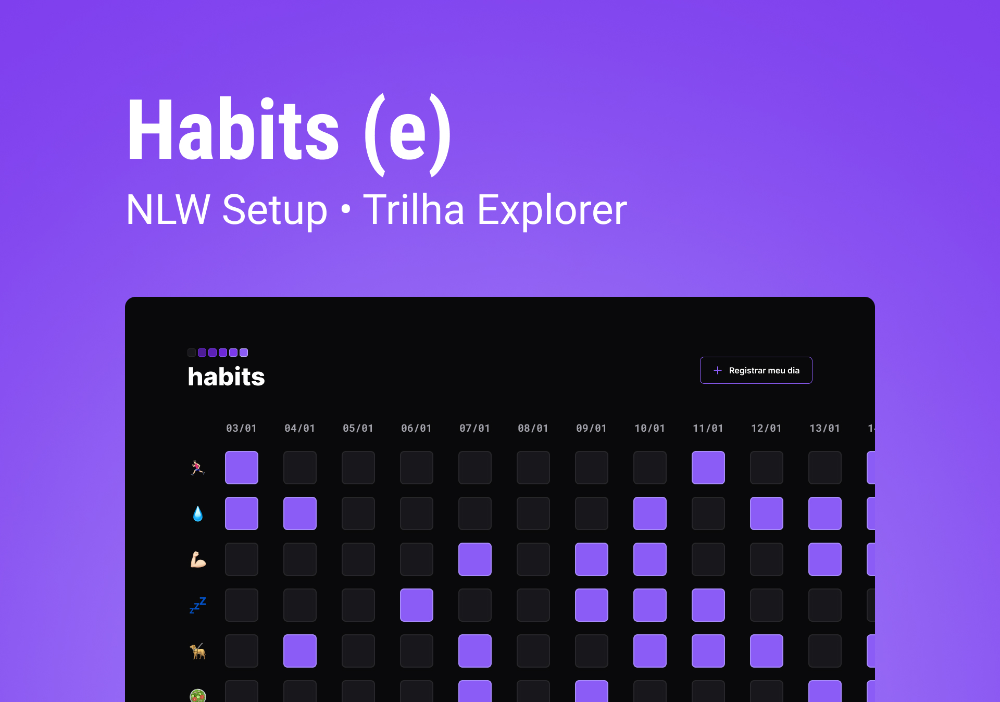

<h1 align="center"> Habits </h1>

NLW é um evento exclusivo e gratuito, promovido pela Rocketseat para ensino de tecnologias WEB.

  <a href="#-tecnologias">Tecnologias</a>&nbsp;&nbsp;&nbsp;|&nbsp;&nbsp;&nbsp;
  <a href="#-projeto">Projeto</a>&nbsp;&nbsp;&nbsp;|&nbsp;&nbsp;&nbsp;
  <a href="#-layout">Layout</a>&nbsp;&nbsp;&nbsp;

 

  
  

 

  

## 🚀 Tecnologias

 

## 💻 Projeto

O Habits é um app para ajudar a rastrear hábitos.
[Visite o projeto](https://andrepaulino.github.io/nlw_explorer_habits/)
 
## 🔖 Layout

Você pode visualizar o layout do projeto [aqui](https://www.figma.com/community/file/1195327109778210238). É necessário ter conta no [Figma](https://figma.com) para acessá-lo.

 

<b>
Se gostou 🌟 - Por André Paulino {🎧}
</b>

